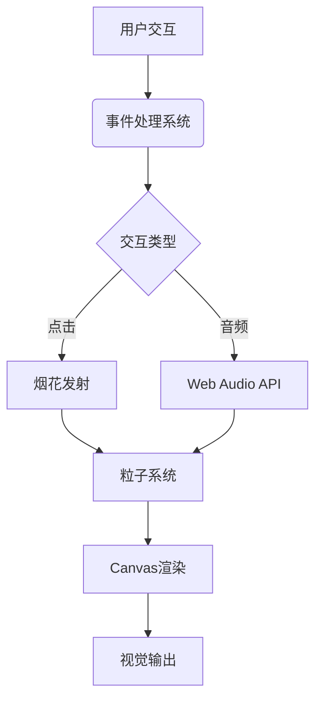

# 2026跨年盛典倒计时系统

✨ 一个融合动态烟花、音频可视化与沉浸式交互的跨年倒计时项目


## 🌟 功能特点

1. **核心功能**
   - 实时新年倒计时显示
   - 自动日历计算（支持闰年）
   - 零日自动切换庆祝模式

2. **视觉效果**
   - 多层级粒子烟花系统
   - 动态星空背景
   - 冲击波特效
   - 光晕拖尾效果
   - 3D立体按钮
   - 玻璃拟态UI

3. **交互功能**
   - 点击/触摸发射烟花
   - 音乐播放控制
   - 实时音频可视化
   - 时间单位悬浮动画

4. **技术特性**
   - 硬件加速渲染
   - 自适应分辨率
   - 移动端优化
   - 智能内存管理

## 🔧 参数配置指南

在`<script>`部分找到以下类进行参数调整：

### 烟花系统 (`FireworksSystem`)
```javascript
// fireworks.js
const CONFIG = {
  MAX_ROCKETS: 15,          // 最大同时存在火箭数
  STAR_COUNT: 300,          // 背景星星数量
  TRAIL_LENGTH: 25,         // 拖尾效果长度
  EXPLOSION_PARTICLES: 150, // 每个烟花爆炸粒子数
  SHOCKWAVE_COUNT: 50,      // 冲击波数量
  RIPPLE_PARTICLES: 30      // 点击涟漪粒子数
};
```

### 火箭参数 (`Rocket`)
```javascript
// rocket.js
const ROCKET_CONFIG = {
  INIT_SIZE: 15,            // 初始大小
  MIN_Y: 0.15,             // 爆炸触发高度 (屏幕高度比例)
  VELOCITY: {
    X: [-5, 5],            // X轴速度范围
    Y: [-18, -10]          // Y轴速度范围
  },
  DECAY: 0.97              // 尺寸衰减系数
};
```

### 爆炸粒子 (`ExplosionParticle`)
```javascript
// particle.js
const PARTICLE_CONFIG = {
  SIZE: [5, 15],           // 粒子大小范围
  VELOCITY: 20,            // 初始速度最大值
  ALPHA_DECAY: 0.012,      // 透明度衰减速度
  GRAVITY: 0.1             // 重力系数
};
```

## 🚀 快速开始

### 本地运行
```bash
git clone https://github.com/your-repo/nye-countdown.git
cd nye-countdown
# 放置背景音乐文件并重命名为background.mp3
python -m http.server 8000
```
访问 `http://localhost:8000`

### 生产部署
1. 配置Web服务器（Nginx/Apache）
2. 优化操作：
   ```nginx
   gzip on;
   add_header Cache-Control "public, max-age=31536000";
   ```

## 🎮 使用指南

### 基础交互
- 单击任意位置发射烟花
- 右键点击切换烟花颜色模式
- 按钮控制：
  - ▶ 播放背景音乐 
  - ⏸ 暂停音乐
  - 旋转化按钮切换播放模式

### 高级功能
- **烟花连发**：快速点击三次触发连发模式
- **颜色锁定**：长按按钮3秒锁定当前配色方案
- **性能模式**：连续点击标题5次切换低性能模式

## 🖥 技术架构



## 🌈 设计规范

1. **颜色系统**
   ```javascript
   :root {
     --primary: #ff3366;  // 主品牌色
     --secondary: #33ccff; // 辅助色
     --accent: #ffcc33;   // 强调色
   }
   ```

2. **动效曲线**
   - 按钮动画：`cubic-bezier(0.68,-0.55,0.27,1.55)`
   - 悬浮效果：`ease-out`
   - 烟花运动：二次贝塞尔曲线

## 🛠 开发指南

### 扩展功能
1. 新增烟花类型：
```javascript
class CustomFirework extends Rocket {
  constructor() {
    super();
    this.colorMode = 'rainbow';
  }
}
```

2. 添加节日主题：
```css
/* 圣诞节主题 */
[data-theme="christmas"] {
  --primary: #ff0000;
  --secondary: #3c8d40;
}
```

## 📱 移动端适配

| 特性 | 支持情况 |
|------|---------|
| 触摸事件 | ✅ 完全支持 |
| 陀螺仪控制 | ⚠️ 实验性功能 |
| 手势操作 | ✅ 双指缩放禁用 |
| 性能优化 | ✅ 自动降级模式 |

## 🚨 常见问题

Q: 音乐无法播放?  
A: 确保：
1. 文件名为`background.mp3`
2. 放在项目根目录
3. 浏览器支持MP3格式

Q: 动画卡顿?  
A: 尝试：
1. 关闭其他标签页
2. 在URL后添加`?performance=low`
3. 更新显卡驱动

---

**License**: MIT  
**维护者**: 小饿工作室  
**版本**: 2.1.0 (2026-ready)
```
孩子饿饿，想吃饭饭qwq
[施舍链接](https://tool.guliucang.com/o/universal_pay_view/?data=eyJxcSI6Imh0dHBzOi8vaS5xaWFuYmFvLnFxLmNvbS93YWxsZXQvc3FyY29kZS5odG0%2FbT10ZW5wYXkmZj13YWxsZXQmYT0xJnU9NTM2NzA2MTY0Jm49JUU1JUE0JUE5JUU1JUE0JUE5JUU5JUE1JUJGJUUyJTgxJUE3JUUyJTgxJUE3JTdFJUU1JTk2JUI1JUUyJTgxJUE3JUUyJTgwJUFEKyZhYz1DQUVROVBqMV93RVlrY1RDdWdZeURPUzRxdVM2dXVla3Z1UzZwRGdCUWlCbFl6UTBaV1l6T0dVeE56VXhaamMzTVRKaU1EazNaVGxpWmpRNU16Vm1OUSUzRCUzRF94eHhfc2lnbiIsIndlaXhpbiI6Ind4cDovL2YyZjBxNktPbnNXN1NIMnVteVZqTDhXbkR1VHExVHVuWDZOVlljMHBYWDJzY1NUV3lwaGI5ZEdoZEw1aUpaOWJ3LWNnIiwiYWxpcGF5IjoiaHR0cHM6Ly9xci5hbGlwYXkuY29tL2ZreDE2MjQzYXZtdmt6cjhrbWxjajViIn0%3D)
